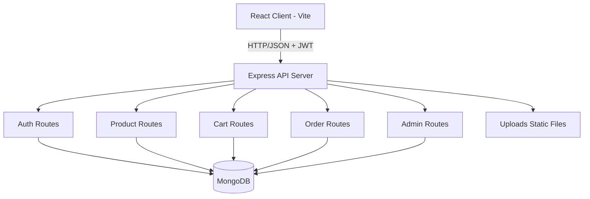

# Shopora (MERN E-Commerce) - Standard Project Report

## 1. Project Identification

- Project Title: Shopora - MERN E-Commerce Platform
- Project Type: Full Stack Web Application (Internship Project)
- Domain: E-Commerce
- Development Model: Incremental module-based implementation
- Repository: mern-ecommerce
- Owner: Student36917Abhishek

## 2. Abstract

Shopora is a full stack e-commerce web application built using the MERN stack (MongoDB, Express.js, React, Node.js). The system supports customer operations such as registration, authentication, product browsing, cart management, checkout, and order tracking. It also includes role-based dashboards for admin and seller users. Admin users can manage products, orders, users, seller approvals, and audit logs. The platform includes JWT-based authentication, request rate limiting, validation middleware, security headers, and product image upload support.

This project is designed as an internship-level implementation focusing on functional completeness, clean architecture, and practical understanding of real-world e-commerce workflows.

## 3. Objectives

- Build an end-to-end e-commerce workflow from login to order placement.
- Implement role-based access control for user, seller, and admin.
- Develop a modular backend with reusable middleware and utilities.
- Build a modern responsive frontend with a clean UI and structured routing.
- Implement practical features such as inventory control, seller approval, and audit logging.
- Demonstrate full stack integration between React frontend and Express/MongoDB backend APIs.

## 4. Scope of the Project

### In Scope

- User registration and login
- JWT-protected routes
- Product listing, search, filters, and detail page
- Cart add/update/delete/clear
- Checkout and order placement
- User order history and order details
- Admin dashboard with metrics and activity feeds
- Admin product CRUD
- Admin order status management
- Admin user management and seller request approval
- Audit log tracking for important admin/seller actions
- Product image upload and display

### Out of Scope (Current Version)

- Real payment gateway integration (Stripe/Razorpay)
- Email sending service (production SMTP provider)
- Automated test suite and CI pipeline
- Deployment automation

## 5. System Requirements

### 5.1 Software Requirements

- Operating System: Windows / Linux / macOS
- Node.js: v18+ recommended
- npm: v9+ recommended
- MongoDB: v6+ (local or Atlas)
- Browser: Latest Chrome/Edge/Firefox
- IDE: VS Code recommended

### 5.2 Hardware Requirements (Recommended for Development)

- Processor: Dual-core 2.0 GHz or higher
- RAM: 8 GB minimum (16 GB recommended)
- Storage: 2 GB free space minimum
- Network: Stable internet for package installation and optional cloud DB

## 6. Technology Stack

### Frontend

- React 19
- Vite 8
- React Router DOM 7
- Axios
- Custom CSS (responsive layout)

### Backend

- Node.js
- Express 5
- Mongoose 9
- JWT (jsonwebtoken)
- bcryptjs
- multer (file upload)
- helmet
- cors
- express-rate-limit
- validator

### Database

- MongoDB

## 7. High-Level Architecture

Shopora follows a client-server architecture with clear separation of concerns.

### Architectural Layers

- Presentation Layer: React pages and components
- API Layer: Express routes and middleware
- Business/Data Layer: Mongoose models and query logic
- Cross-cutting Layer: Auth, validation, rate limiting, error handling, audit logs

## 8. Project Structure

### Backend

- server/config - database connection
- server/controllers - auth controller
- server/middleware - auth, validation, rate limiting, upload, error handling
- server/models - User, Product, Cart, Order, AuditLog
- server/routes - auth, products, cart, orders, admin
- server/utils - token generation, API response helper, audit logging
- server/uploads - uploaded product images

### Frontend

- client/src/pages - all user/admin/seller pages
- client/src/components - reusable UI and route guards
- client/src/context - Auth context
- client/src/services - API service modules
- client/src/utils - helper utilities
- client/src/index.css - design system and responsive styles

## 9. Database Design

## 9.1 Collections

1. Users

- name, email, password, role
- sellerRequest object (status, note, review info)
- avatar, isEmailVerified
- reset/email verification token fields
- addresses array
- timestamps

2. Products

- name, description, price, category, stock
- image (URL or /uploads path)
- seller reference
- timestamps

3. Carts

- user reference (unique)
- items array with product snapshot (name, image, price, quantity)
- subtotal, tax, shippingFee, grandTotal, totalItems
- timestamps

4. Orders

- user reference
- orderItems array with product snapshot
- shippingAddress object
- totals and payment fields
- orderStatus lifecycle
- notes, deliveredAt, paidAt
- timestamps

5. AuditLogs

- actor reference and role
- action, targetType, targetId
- details object
- timestamps

## 9.2 Key Relationships

- One user -> one cart
- One user -> many orders
- One seller/admin -> many products
- One user -> many audit logs (as actor)

## 10. Core Functional Modules

## 10.1 Authentication and Authorization

- Register, login, profile view/update
- Forgot/reset password token flow
- Email verification token flow
- Seller request submission
- JWT bearer token protection
- Role checks: adminOnly, sellerOrAdmin

## 10.2 Product Management

- Public product catalog with pagination and search filters
- Product detail by ID
- Admin/seller create, update, delete
- Ownership check for seller updates/deletes
- Product image upload using multipart/form-data

## 10.3 Cart Module

- Get cart and auto-create cart if absent
- Add/update/remove item
- Clear cart
- Checkout preview endpoint
- Automatic cart recalculation (subtotal/tax/shipping/grand total)
- Stock synchronization with product updates

## 10.4 Order Module

- Place order from cart
- Validate shipping and payment method
- Decrement product stock after order
- Clear cart after successful order
- User order history and detail view
- Admin order list and status updates

## 10.5 Admin Module

- Dashboard metrics (revenue, users, products, orders, pending, low stock)
- Recent orders/users/low-stock products
- Recent audit logs
- Registered user list
- Seller request approval/rejection flow

## 10.6 Audit Logging

- Logs key admin/seller actions such as:
- product_created
- product_updated
- product_deleted
- order_status_updated
- seller_request_submitted
- seller_request_approved/rejected

## 11. Security and Validation Mechanisms

- Helmet security headers
- CORS enabled with credentials
- JWT authentication middleware
- Role-based route guards
- Rate limiting for auth and password reset routes
- Field validation middleware (register/login/product CRUD)
- Request sanitization for body and params
- Password hashing using bcryptjs
- Protected static image serving for uploads endpoint

## 12. API Overview (Main Routes)

### Auth

- POST /api/auth/register
- POST /api/auth/login
- GET /api/auth/profile
- PUT /api/auth/profile
- POST /api/auth/logout
- POST /api/auth/forgot-password
- POST /api/auth/reset-password/:token
- GET /api/auth/verify-email/:token
- POST /api/auth/seller-request

### Products

- GET /api/products
- GET /api/products/:id
- GET /api/products/mine (protected seller/admin)
- POST /api/products (protected seller/admin)
- PUT /api/products/:id (protected seller/admin)
- DELETE /api/products/:id (protected seller/admin)

### Cart

- GET /api/cart
- GET /api/cart/checkout-preview
- POST /api/cart
- PUT /api/cart/:productId
- DELETE /api/cart/:productId
- DELETE /api/cart

### Orders

- GET /api/orders/meta
- POST /api/orders
- GET /api/orders/my
- GET /api/orders/:id
- GET /api/orders/admin/all (admin)
- PUT /api/orders/admin/:id/status (admin)

### Admin

- GET /api/admin/dashboard
- GET /api/admin/users
- GET /api/admin/seller-requests
- PUT /api/admin/seller-requests/:id
- GET /api/admin/audit-logs

## 13. Frontend Pages and Routing

### Public

- / (home)
- /products
- /products/:productId
- /login
- /register

### Protected User

- /app (account dashboard)
- /cart
- /checkout
- /orders
- /orders/:orderId
- /sell

### Seller

- /seller/products

### Admin

- /admin
- /admin/products
- /admin/orders
- /admin/users

## 14. Implementation Steps (Reproducible)

1. Clone repository
2. Install backend dependencies
3. Install frontend dependencies
4. Configure environment variables
5. Start backend server
6. Start frontend dev server
7. Seed initial admin/product data (optional)
8. Test user flow: register -> login -> browse -> cart -> checkout -> order
9. Test admin flow: login as admin -> dashboard -> manage products/orders/users

## 14.1 Commands

Backend:

- cd server
- npm install
- npm run dev

Frontend:

- cd client
- npm install
- npm run dev

Optional seed:

- npm run seed:admin
- npm run seed:products

## 15. Non-Functional Characteristics

- Usability: clean page-wise module separation and role-specific UI
- Maintainability: modular route and middleware structure
- Reliability: validations and role checks on sensitive operations
- Performance (internship scale): suitable for low-to-moderate dataset size
- Portability: can run on any OS with Node.js and MongoDB

## 16. Known Limitations

- No transaction wrapping yet for full order atomicity
- No integrated payment gateway workflow
- No production email service integration
- No automated tests yet
- Limited production-grade observability/logging

## 17. Future Enhancements

- Payment integration (Stripe/Razorpay)
- Email service integration (verification/reset/order notifications)
- Transactions for order placement consistency
- Product review/ratings module
- CI/CD pipeline and test automation
- Advanced analytics and report exports

## 18. Conclusion

Shopora demonstrates a solid full-stack MERN implementation with practical e-commerce workflows and role-based management. The project successfully covers all core internship objectives: modular backend architecture, secure authentication, product/cart/order lifecycle, admin monitoring tools, and responsive frontend UX. It is a strong foundation for future production-focused enhancements.

## 19. References

- Node.js documentation
- Express.js documentation
- React documentation
- MongoDB and Mongoose documentation
- JWT authentication best practices

---

Prepared from the current implementation state of the repository.
